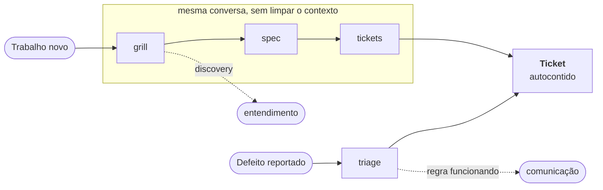
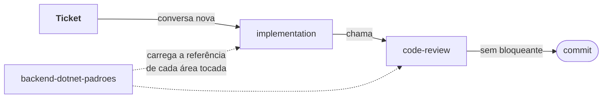

# Skills de desenvolvimento backend .NET

Oito skills que levam um trabalho backend da ideia solta até o commit, aplicando os padrões da
equipe de arquitetura em cada linha de código escrita pelo caminho.

**8 skills · 9 referências · 4 tipos de trabalho · 0 dependências externas**

- [A ideia central](#a-ideia-central)
- [Instalar](#instalar)
- [Os dois grupos de invocação](#os-dois-grupos-de-invocação)
- [As oito skills](#as-oito-skills)
- [Fluxos por tipo de trabalho](#fluxos-por-tipo-de-trabalho)
- [Os padrões](#os-padrões)
- [Armadilhas](#armadilhas)
- [Manter vivo](#manter-vivo)

---

## A ideia central

Duas coisas diferentes moram aqui, e separá-las é o que faz o conjunto funcionar.

**Os padrões** são a documentação da equipe de arquitetura em forma que o agente alcança:
nomenclatura, camadas, contratos de API, NHibernate, IoC, testes, observabilidade. São duráveis e
valem em qualquer tarefa. É o ativo.

**Os fluxos** são uma opinião sobre como trabalhar: entrevistar antes de codar, virar a conversa
em spec, quebrar em tickets, implementar, revisar. São úteis, mas são uma opinião — e uma tarefa
pode legitimamente não precisar deles.

Por isso os padrões não moram dentro dos fluxos. Eles ficam em uma skill que o agente alcança
sozinho, de qualquer lugar: dentro do tronco de implementação, numa investigação solta, num code
review avulso. Você nunca precisa lembrar de encaminhá-los.

---

## Instalar

```bash
git clone https://github.com/tallisazevedo/ia-skill.git
cd ia-skill
./install.sh
```

O instalador é interativo e nada vem marcado: você digita, na hora, quais ferramentas recebem
as skills — Claude Code, Codex, Gemini CLI, Cursor, OpenCode ou **Todas**.

Se a escolha for de ferramentas individuais, ele pergunta onde instalar: na **estrutura
específica** de cada ferramenta ou em `~/.agents/skills` compartilhado (uma cópia só, com links
a partir de cada ferramenta). Com **Todas**, cada ferramenta recebe na sua estrutura específica,
sem pergunta.

A família é mantida e testada para cinco ferramentas:

| Ferramenta | Estrutura específica | Invocação por nome vem de |
|---|---|---|
| Claude Code | `~/.claude/skills` | `disable-model-invocation` no frontmatter |
| Codex | `~/.codex/skills` | `policy.allow_implicit_invocation` no `agents/openai.yaml` |
| Gemini CLI | `~/.gemini/skills` | frontmatter |
| Cursor | `~/.cursor/skills` | frontmatter |
| OpenCode | `~/.config/opencode/skills` | frontmatter |

A instalação é sempre no escopo do usuário (global), para as skills valerem em qualquer
projeto. Guarde o clone: ele é a base da atualização.

Para atualizar depois:

```bash
git pull
./install.sh
```

### Seu primeiro uso

Invoque `backend-dotnet` e descreva o que você vai fazer; o roteador escolhe o fluxo. Se você já
sabe o que quer, pule direto: `backend-dotnet-grill` para um trabalho ainda em aberto,
`backend-dotnet-triage` para um defeito que chegou de fora.

A sintaxe muda por ferramenta — no Claude Code é `/backend-dotnet`; no Codex, no Gemini CLI, no
Cursor e no OpenCode a skill é chamada pelo nome, no seletor de skills ou na conversa. O nome é
sempre o mesmo.

---

## Os dois grupos de invocação

Toda skill da família cai em um de dois grupos, e a diferença não é cosmética — ela decide quem
consegue acionar cada uma.

### Por nome — os portões que você abre

`backend-dotnet`, `grill`, `triage`, `spec`, `tickets`.

Só respondem quando você digita o nome. O agente nunca as dispara sozinho, e nenhuma outra skill
consegue chamá-las — nem o próprio roteador, que só consegue indicá-las. São os momentos em que a
decisão é sua: entrevistar ou não, escrever a spec agora ou depois, cortar em tickets. Não custam
nada quando você não usa.

### Alcançadas pelo agente — o trabalho que acontece

`padroes`, `implementation`, `code-review`.

O agente alcança sozinho, e uma pode chamar a outra. É o que permite que `implementation` aplique
os padrões e chame o code review sem você digitar nada no meio do caminho. Em troca, as
descrições dessas três ficam carregadas em toda sessão — ~260 tokens, o preço de o padrão nunca
depender da sua memória.

---

## As oito skills

### `backend-dotnet` · por nome

O roteador. Não faz trabalho: escolhe o fluxo e mostra o caminho.

| | |
|---|---|
| **Quando** | Você não sabe qual skill usar |
| **Produz** | A indicação da próxima skill, e a ordem do tronco |

### `backend-dotnet-grill` · por nome

A entrevista. Mapeia o trabalho como árvore de decisão e interroga rodada por rodada até nada
restar como suposição silenciosa. Cada rodada pergunta toda a **fronteira** de uma vez — as
decisões cujos pré-requisitos já foram respondidos — e espera você responder antes da próxima.

É a skill que atende os quatro tipos de trabalho: ela confirma o tipo com você e carrega o banco
de dimensões correspondente. Descobrir **fatos** é trabalho dela; as **decisões** são suas.

| | |
|---|---|
| **Quando** | O trabalho ainda tem decisão em aberto |
| **Produz** | A árvore com cada ramo decidido ou marcado como não aplicável |
| **Depois** | `spec`, na mesma conversa |

### `backend-dotnet-triage` · por nome

A porta dos defeitos. Reproduz, localiza a camada e classifica a causa em três: regra funcionando
mal comunicada, falha de infraestrutura, ou defeito de implementação.

Os desfechos são dois, e só um vira ticket. Quando a regra está funcionando, não há o que
corrigir — o desfecho é comunicação, e o fluxo termina ali.

| | |
|---|---|
| **Quando** | Um defeito chegou de fora como sintoma |
| **Não use** | Para pedido externo que não é defeito. Isso é grill |
| **Produz** | Um ticket em `specs/<slug>/tickets/` com causa raiz e critério de aceite falseável, ou a constatação de que não há defeito |

### `backend-dotnet-spec` · por nome

A transcrição decidida do grill — não uma entrevista nova. Organiza o que já foi respondido em um
documento com objetivo, regras e invariantes, contratos, casos de validação, fora de escopo e
riscos residuais. Se uma decisão ainda estiver em aberto, ela manda você voltar ao grill em vez
de preencher a lacuna com suposição.

| | |
|---|---|
| **Quando** | Logo após o grill, na mesma conversa |
| **Produz** | `specs/<slug>/spec.md` no repositório da solução |

### `backend-dotnet-tickets` · por nome

Corta a spec em fatias verticais: cada ticket entrega e valida uma parte coerente do
comportamento, não uma camada isolada. Cada um declara as dependências, e a lista sai em ordem
topológica com os paralelizáveis marcados.

A régua: um ticket lido isoladamente precisa ser implementável, sem reler a spec nem a conversa
do grill.

| | |
|---|---|
| **Quando** | Após a spec, na mesma conversa |
| **Produz** | Um arquivo por ticket em `specs/<slug>/tickets/`, na pasta da spec |

### `backend-dotnet-padroes` · alcançada pelo agente

A porta única para os padrões da empresa. Dispara sozinha em qualquer código backend .NET escrito
ou revisado, em qualquer tarefa, e carrega a referência da área que a mudança toca.

Cada referência traz seus próprios critérios de conclusão, e eles contam como parte do trabalho:
área tocada sem critério satisfeito não está pronta.

| | |
|---|---|
| **Quando** | Sozinha. Você não precisa chamá-la |
| **Produz** | A referência certa carregada no momento em que o código é escrito |

### `backend-dotnet-implementation` · alcançada pelo agente

O tronco: delimita a mudança a partir do ticket, implementa aplicando os padrões, verifica com o
teste mais estreito que pode falsificar a hipótese, chama o code review e entrega o resumo.

| | |
|---|---|
| **Quando** | A partir de um ticket, em conversa nova |
| **Produz** | A mudança implementada, validada e revisada |

### `backend-dotnet-code-review` · alcançada pelo agente

Duas perguntas que não se substituem: o código segue os padrões da empresa, e o código entrega o
que o ticket pediu. Confronta cada arquivo do diff com a referência aplicável, e cada critério de
aceite com a evidência no diff.

Sinaliza os dois desvios: critério sem evidência, e mudança no diff que não corresponde a
critério nenhum. Cada achado precisa de arquivo e trecho — impressão geral sem localização não é
achado.

| | |
|---|---|
| **Quando** | Chamada por `implementation`, ou por você a qualquer momento |
| **Produz** | Lista única, cada item marcado como bloqueante ou sugestão |

---

## Fluxos por tipo de trabalho

O grill pergunta primeiro qual é o tipo de trabalho, porque o tipo decide quais dimensões a
entrevista percorre. A lista de robustez que serve uma feature nova atrapalha numa migração — e
vice-versa.

| Tipo | O risco | O que a entrevista percorre |
|---|---|---|
| **Feature nova** | Decidir errado o que está aberto | Invariantes, concorrência, idempotência, transação, dependências externas, exceções, observabilidade, dados sensíveis, compatibilidade, cobertura |
| **Migração** | Não enxergar o que já está decidido e em uso | Paridade de comportamento, consumidores do contrato, convivência, cutover e rollback, dados legados, autenticação, o que não migra |
| **Bug com decisão nova** | Consertar o sintoma e não a classe | Invariante violada, escopo do conserto, compatibilidade, taxonomia de exceções, observabilidade, regressão |
| **Discovery** | Concluir sem ter olhado | Comportamento atual, contratos e consumidores, regras embutidas, acoplamento, dívida, o que ninguém documentou |

O **discovery inverte o contrato**: a fronteira é feita de desconhecidos sobre o código,
resolvê-los é trabalho do agente, e a entrega é entendimento — não ticket. As decisões que ele
revelar entram num grill posterior.

### Como um trabalho vira ticket



Duas entradas convergem no ticket. Os caminhos tracejados terminam sem ticket: o discovery
entrega entendimento, e a triagem que conclui "regra funcionando" fecha em comunicação.

### Como um ticket vira commit



O code review não depende de você lembrar: `implementation` o chama antes de entregar. Os dois
carregam os padrões pela mesma porta.

---

## Os padrões

Ficam em [`skills/backend-dotnet-padroes/references/`](skills/backend-dotnet-padroes/references) e são expostos por
`backend-dotnet-padroes`. Cada um carrega seus próprios critérios de conclusão.

| Referência | Cobre |
|---|---|
| [`architecture.md`](skills/backend-dotnet-padroes/references/architecture.md) | Responsabilidade de cada camada e onde uma regra deve morar |
| [`naming.md`](skills/backend-dotnet-padroes/references/naming.md) | Nomenclatura e linguagem ubíqua em português |
| [`domain.md`](skills/backend-dotnet-padroes/references/domain.md) | Entidades válidas desde a construção, serviços, comandos, validação |
| [`application.md`](skills/backend-dotnet-padroes/references/application.md) | Request, Response, AppService, orquestração, async e `CancellationToken` |
| [`api.md`](skills/backend-dotnet-padroes/references/api.md) | URI, códigos e formato de resposta, paginação, JSON, Swagger, autenticação |
| [`persistence.md`](skills/backend-dotnet-padroes/references/persistence.md) | Mapeamento NHibernate, repositórios, Unit of Work, Dapper, HttpClient |
| [`ioc.md`](skills/backend-dotnet-padroes/references/ioc.md) | Registro de dependências, bootstrapper, ciclo de vida |
| [`testing.md`](skills/backend-dotnet-padroes/references/testing.md) | Testes de domínio, nomenclatura de casos, cobertura |
| [`observability.md`](skills/backend-dotnet-padroes/references/observability.md) | Logs estruturados, EventoId, níveis, dados sensíveis |

### Duas regras atravessam todas as áreas

**Linguagem ubíqua em português.** Conceitos de negócio usam o termo real do domínio — `Pedido`,
`Credenciado`, `OrdemDeServico` — nunca a tradução. Inglês fica reservado para nomes de padrões
de projeto: `Repository`, `Factory`, `Strategy`.

**Dados sensíveis não circulam.** Senha, token, segredo e credencial não entram em log, corpo de
erro ou mensagem de fila.

---

## Armadilhas

**Limpar o contexto entre grill, spec e tickets.** As três moram na mesma conversa de propósito.
A spec é a transcrição do que o grill decidiu; se o contexto sumir, ela vira uma entrevista nova
— ou pior, uma invenção.

**Implementar na mesma conversa do grill.** É o inverso, e é igualmente errado. A implementação
começa em conversa **nova**, recebendo só o arquivo do ticket. Se o ticket não for suficiente
sozinho, o problema está no ticket — e é melhor descobrir isso agora do que na próxima pessoa que
pegar um.

**Responder o grill por você.** O agente descobre fatos sozinho — schema existente, contrato
publicado, comportamento atual. Mas as decisões são suas, e *"não sei"* é resposta válida: ela
vira uma investigação registrada, nunca uma suposição. Se uma sessão inteira passou sem você
discordar de nenhuma recomendação, ela foi dispensável.

**Mandar pedido externo para a triagem.** A triagem é para defeito: ela reproduz e classifica
causa raiz. Um pedido de feature ou de mudança de contrato não tem causa raiz, tem requisito —
vai para o grill, mesmo que tenha chegado "pronto". Quem pede de fora nunca decidiu invariante,
concorrência ou compatibilidade.

**Assumir que o padrão corporativo vence sempre.** Não vence. Em um repositório que segue outro
padrão, o padrão do repositório ganha — e a divergência é registrada no resumo da mudança. Os
padrões da empresa são o default, não uma imposição cega.

---

## Manter vivo

Quando o time de arquitetura mudar uma regra, atualize a **referência** correspondente — não a
skill. As skills apontam para as referências justamente para que exista um lugar só a editar.

### Antes de abrir PR

- A regra nova tem **um** lugar, ou você acabou de criar uma segunda fonte de verdade?
- A seção nova termina em um critério de conclusão verificável?
- A skill continua autossuficiente, sem link `../` para a pasta de outra skill?
- Se você adicionou uma skill, ela entrou em `.claude-plugin/plugin.json` e ganhou seu
  `agents/openai.yaml`? (O `install.sh` descobre sozinho tudo que está em `skills/`.)
- Se você mexeu na invocação de uma skill, este README e o roteador ainda dizem a verdade?
